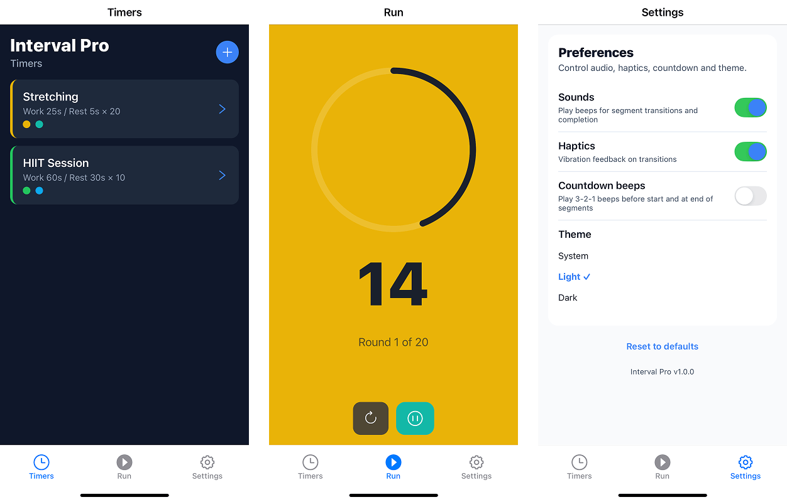

# Interval Pro

A simple interval training timer app built with React Native and Expo. Good for workouts, HIIT, Tabata, and any activity that needs timed intervals.

## Features

- **Custom Timer Creation**: Make your own interval timers with work and rest segments
- **Visual Progress Tracking**: Progress rings and color-coded segments
- **Multiple Timer Management**: Save and organize multiple timer setups
- **Background Support**: Keeps running when app is in the background
- **Sound & Haptic Feedback**: Audio sounds and vibration for segment changes
- **Customizable Themes**: Color themes for different workout types
- **Settings & Preferences**: Light/dark mode and notification settings

## Screenshots



## Usage

### Timer Management

- View all saved timers on the main screen
- Tap to run a timer instantly
- Long press to edit or delete timers
- Create new timers with the + button

### Timer Creation

- Set custom work and rest intervals (minutes and seconds)
- Configure number of rounds
- Choose from predefined color themes
- Preview timer configuration before saving

### Timer Execution

- Large countdown display
- Progress ring showing segment progress
- Different background colors for work vs rest
- Play/pause controls
- Skip to next/previous segment
- Restart timer option

## Technical Stack

- **Framework**: React Native with Expo
- **Navigation**: Expo Router (file-based routing)
- **State Management**: React Context API
- **Storage**: AsyncStorage for persistent timer data
- **Audio**: Expo AV for sound playback
- **Notifications**: Expo Notifications
- **Haptics**: Expo Haptics for vibration feedback

## Installation

1. Clone the repository:

   ```bash
   git clone https://github.com/madeleinewoodbury/interval-app
   cd interval-app
   ```

2. Install dependencies:

   ```bash
   npm install
   ```

3. Start the development server:
   ```bash
   npm start
   ```

## Development Scripts

- `npm start` - Start the Expo development server
- `npm run android` - Run on Android device/emulator
- `npm run ios` - Run on iOS device/simulator
- `npm run web` - Run in web browser
- `npm run lint` - Run ESLint code linting

## Project Structure

```
src/
├── components/          # Reusable UI components
│   ├── ColorThemePicker.tsx
│   └── ProgressRing.tsx
├── constants/           # App constants and configurations
│   └── colorThemes.ts
├── context/            # React Context providers
│   ├── SettingsProvider.tsx
│   └── TimerProvider.tsx
├── engine/             # Timer engine logic
│   └── timerEngine.ts
├── services/           # External services
│   ├── NotificationService.ts
│   └── TimerStorage.ts
├── utils/              # Utility functions
│   └── themeGenerator.ts
└── types.ts            # TypeScript type definitions

app/
├── _layout.tsx         # Root layout component
├── index.tsx           # Main timers list screen
├── create-timer.tsx    # Timer creation/editing screen
├── run.tsx            # Timer execution screen
└── settings.tsx       # App settings screen
```

## Key Features Explained

### Timer Engine

The `TimerEngine` class handles all timer logic including:

- Accurate timing with drift fix
- State management (idle, countdown, running, paused, finished)
- Background time tracking when app is backgrounded
- Segment and round changes

### Storage

Timers are saved to device storage using AsyncStorage, so your timers stay saved between app sessions.

### Background Mode

The app tracks time in the background to keep accurate timing even when the device is locked or the app is backgrounded.

### Theme System

Color themes change the UI based on the selected timer, giving visual context for different workout types.

## Requirements

- Node.js 18+
- Expo CLI
- iOS Simulator (for iOS development)
- Android Studio/Emulator (for Android development)
